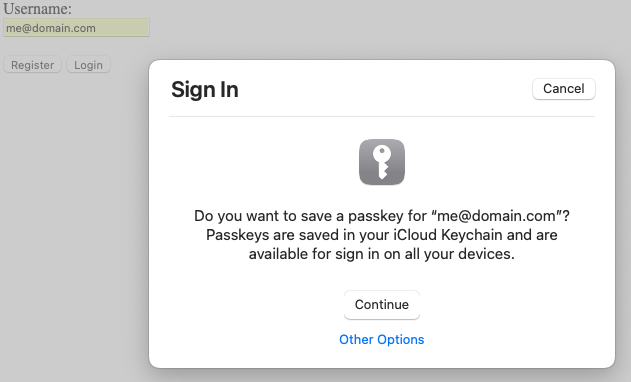
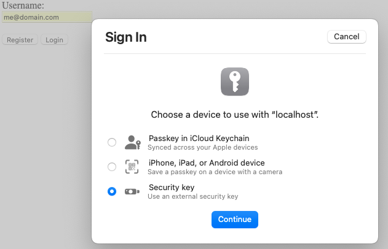
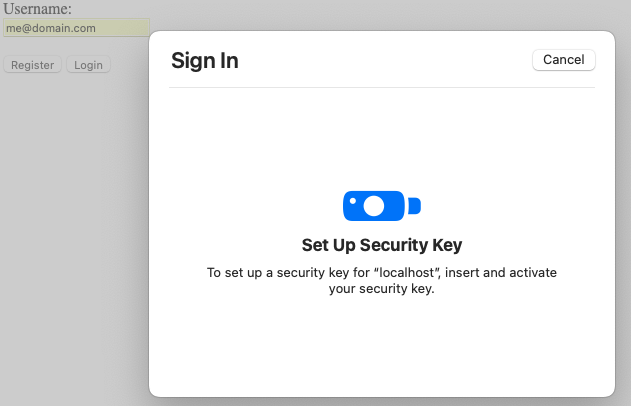

# WebAuthN Example in Go

This is a Demo to provide insight into a WebAuthn flow with FIDO2 being the single step (factor) authenticator.

This is a drop-in template for your next project to get you started.

Note that this example is based on Safari only, in May 2023. Passkeys from Chrome and other browsers cannot yet be stored in the iCloud keychain. This means that your WebAuthn auth using passkeys registered by a specific browser will be tied to that browser. 

## Caveats
See [Passkey Notes](./PasskeyNotes.md) for more detail.

### HTTP(s) Only
This demo does not use TLS so only a connection to http://localhost:8080 will be able to perform WebAuthn functions. I've only tested with Safari on a Mac.

## Demo Walk Through
### Run it

Export these environment variables.
```shell
LISTEN_ADDR=localhost:8080
DB_SERVICE_URL=file:///tmp/webauthn-demo.db
WEBSITE_URL=http://localhost:8080
```

Run with:
```shell
go run main.go
```

Then browse to http://localhost:8080.
### Registration
The [javascript](./views/index.js) communicates with the Safari browser to provide a series of dialogs that collect information about which security device will be used to authenticate this user in the future.  



After providing an email address and clicking the **Register** button, the `/register/begin/{username}` endpoint is called to create a user record and generate a public key for the user. Safari then presents this dialog in response to the javascript function `navigator.credentials.create()`. You may choose to use the passkey provided by the OS (your laptop login passkey) when clicking the **Continue** button, or for this demo, choosing to use a YubiKey by clicking **Other Options**.



This dialog prompts you for the type of authenticator to be used. On Mac Safari you may have options including the Platform passkey (touchID, etc), using your paired iPhone as the authenticator device, or for this example, choosing the **Security Key** to use a YubiKey.



After pressing **Continue** from the previous dialog, Safari presents this dialog and waits for you to press/activate your YubiKey. Safari reads the YubiKey OTP token and validates it with YubiCo. The token is then passed back to the javascript provided in the [index.html](./views/index.js) which calls the `/register/finish/{username}` endpoint to store the user credentials on the server to validate a passkey at login. 

The passkey generated by the browser is saved in iCloud from Safari. You can manage these passkeys from `System Settings/Passwords`. These are explicitly browser-based and are NOT stored in "KeyChain Access".

### Login
Using the [javascript](./views/index.js) which calls the `/login/begin/{username}` and `/login/finish/{username}` endpoints, the Safari browser collects the authentication passkey from the system or requests it from the user.

Login begin sets the `webauthn-session` cookie and returns the public key for the user found in the DB. The javascript in the browser gathers the assertion made by the browser itself. Then calls the finish endpoint to validate the passkey data sent by the browser.

From here on, server endpoints can simply validate the `webauthn-session` cookie. Once the session expires, /login should be called again by the javascript. To logout, the session cookie should be destroyed.

### Login from multiple devices
* Use an roaming authenticator, such as YubiKey
* Register with a Platform passkey from your Mac. You can use an iPhone to authenticate using that same passkey that was stored in iCloud.
* Register the same user with multiple authenticators (Platform, YubiKey, et.al.) - this is the recommended solution to have backup/recovery passkeys in webauthn

### JWT support
Right now I'm unclear as to where JWT signing should occur in the webauthn flow where webauthn is the **single** factor. However, to complete the example of using **ONLY** webauthn for authentication, I added support to sign a JWT and return it on `/login/finish`. An [example key](./TestCertificate.crt) is used in signing. It also satisfies the JWKS' `/well-known/jwks` endpoint.

## Resources
* https://github.com/herrjemand/awesome-webauthn
* https://www.herbie.dev/blog/webauthn-basic-web-client-server/
* https://github.com/go-webauthn/webauthn/blob/master/README.md#quickstart
* https://fidoalliance.org/specs/fido-v2.0-rd-20180702/fido-server-v2.0-rd-20180702.html#registration
* https://github.com/Quiq/webauthn_proxy
* https://developer.apple.com/forums/tags/passkeys-in-icloud-keychain/?page=2&sortBy=oldest
* [Good podcast with transcript](https://podcast.macadmins.org/2023/02/27/episode-304-webauthn-and-webauthn-io/)
* https://webauthn.io
* https://passkeys.dev/docs/reference/macos/
  * [the root](https://passkeys.dev)
  * [WenAuthn Glossary](https://passkeys.dev/docs/reference/terms/)
* [Matt Miller's WebAuthn blog](https://blog.millerti.me) 
  * [Passkeys](https://simplewebauthn.dev/docs/advanced/passkeys) 